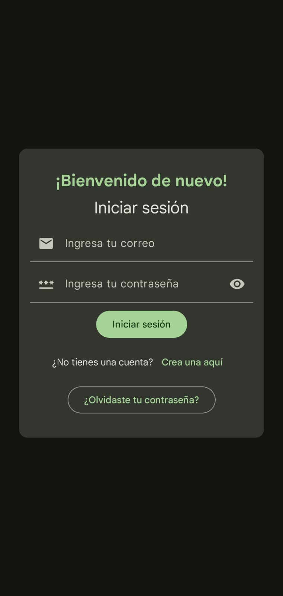
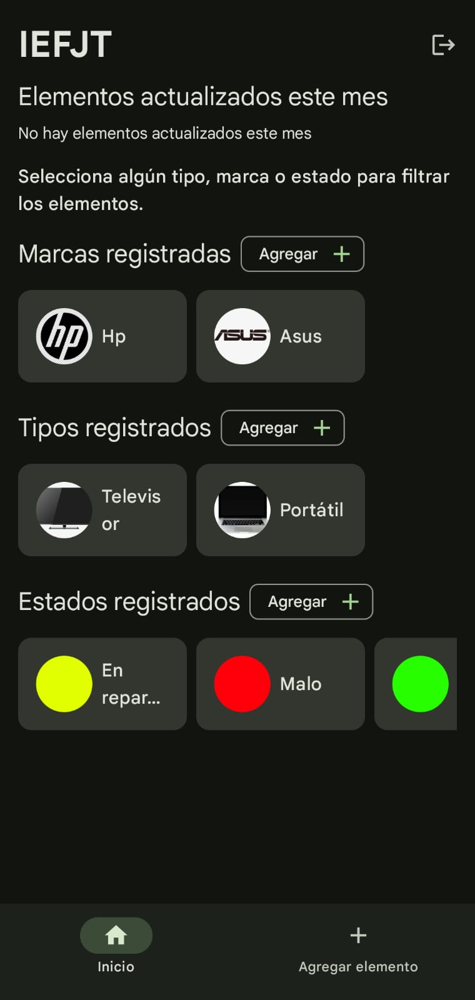
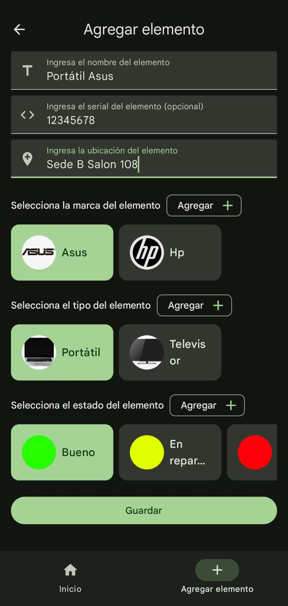
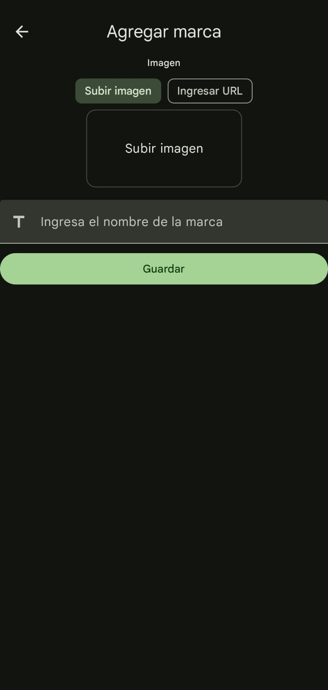
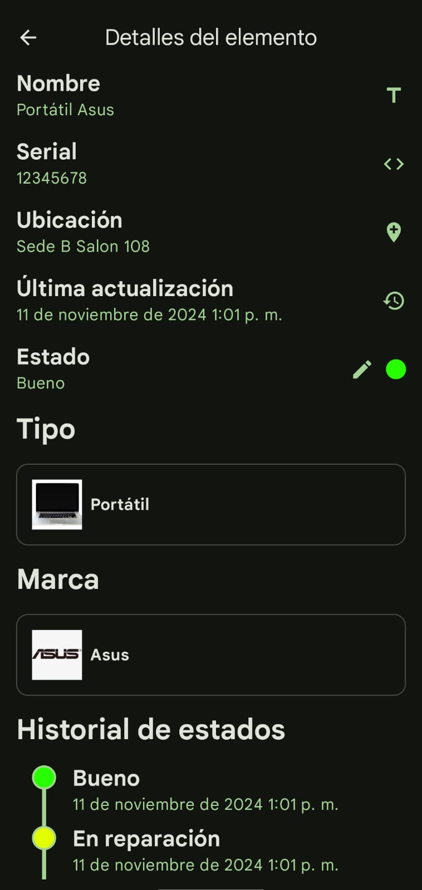

# Sistema de Gestión de Inventario - Institución Educativa Fray Julio Tobón Betancur

## Descripción del Proyecto
Este proyecto tiene como objetivo facilitar la gestión de inventarios en la Institución Educativa Fray Julio Tobón Betancur. Permite realizar el seguimiento y administración de elementos, incluyendo detalles como marcas, tipos, estados, y ubicaciones. Es una herramienta para simplificar el manejo de activos, actualizando su estado en tiempo real.

## Estructura del Proyecto
El sistema cuenta con las siguientes pantallas y funcionalidades principales:

### 1. Pantalla de Inicio de Sesión (Login)
- **Descripción**: Permite el ingreso de usuarios mediante autenticación por correo y contraseña.
- 

### 2. Pantalla de Registro
- **Descripción**: Permite la creación de cuentas de usuario para acceder al sistema.
- 

### 3. Pantalla Principal
- **Descripción**: Muestra los elementos actualizados en el último mes, además de listas de **marcas**, **tipos**, y **estados** registrados, que pueden utilizarse para filtrar en la pantalla de lista de elementos.
- 
- **Componentes**:
  - **Elementos Recientes**: Elementos actualizados este mes.
  - **Marcas Registradas**: Lista de marcas, con opción de selección para filtrado.
  - **Tipos Registrados**: Lista de tipos de elementos, con opción de selección para filtrado.
  - **Estados Registrados**: Lista de estados disponibles, con opción de selección para filtrado.

### 4. Pantalla de Lista de Elementos
- **Descripción**: Muestra la lista de elementos en el inventario que cumplen con el filtro seleccionado (por marca, tipo o estado).
- 
- **Componentes**:
  - **Filtro Aplicado**: Indica el filtro seleccionado (marca, tipo o estado).
  - **Lista de Elementos**: Lista de todos los elementos que cumplen con el filtro seleccionado.

### 5. Pantalla de Agregar Elemento
- **Descripción**: Permite añadir un nuevo elemento al inventario, con campos para nombre, serial, ubicación y listas de selección para marca, tipo y estado.
- 
- **Componentes**:
  - **Nombre**: Campo de texto para el nombre del elemento.
  - **Serial**: Campo para ingresar el número de serie del elemento.
  - **Ubicación**: Campo para especificar la ubicación del elemento.
  - **Marca**: Lista horizontal seleccionable de marcas disponibles.
  - **Tipo**: Lista horizontal seleccionable de tipos disponibles.
  - **Estado**: Lista horizontal seleccionable de estados disponibles.

### 6. Pantalla de Agregar Estado
- **Descripción**: Permite crear un nuevo estado para los elementos, con campos para nombre y selección de color.
- 
- **Componentes**:
  - **Nombre del Estado**: Campo de texto para el nombre.
  - **Color**: Selector de color para asignar un color distintivo al estado.

### 7. Pantalla de Agregar Marca
- **Descripción**: Permite agregar una nueva marca al sistema, con opciones de subir una imagen o ingresar la URL de la imagen.
- 
- **Componentes**:
  - **Nombre de la Marca**: Campo de texto para el nombre.
  - **Imagen**: Opción de subir una imagen o ingresar la URL.

### 8. Pantalla de Agregar Tipo
- **Descripción**: Permite crear un nuevo tipo de elemento, con campos para nombre y selección de imagen (subida o URL).
- 
- **Componentes**:
  - **Nombre del Tipo**: Campo de texto para el nombre.
  - **Imagen**: Opción de subir una imagen o ingresar la URL.

### 9. Pantalla de Detalles del Elemento
- **Descripción**: Muestra los detalles de un elemento, incluyendo su nombre, serial, ubicación, estado actual, fecha de última actualización, marca, tipo, y un historial de cambios de estado.
- 
- **Componentes**:
  - **Nombre del Elemento**
  - **Serial**
  - **Ubicación**
  - **Estado Actual**: Botón para editar estado, que lleva a la pantalla de edición de estado.
  - **Fecha de Última Actualización**
  - **Marca**
  - **Tipo**
  - **Historial de Cambios de Estado**: Línea de tiempo con nombre, color y fecha de cada cambio de estado.

### 10. Pantalla de Edición de Estado
- **Descripción**: Permite editar el estado de un elemento, guardando los cambios en el historial de estados.
- 
- **Componentes**:
  - **Seleccionar Nuevo Estado**: Opción de seleccionar un nuevo estado.
  - **Guardar Cambio**: Botón para guardar el cambio, que se reflejará en el historial de la línea de tiempo.

## Configuración del Proyecto

Para configurar el proyecto, siga estos pasos:

1. **Clonar el Repositorio**:
   - Abra su terminal y ejecute el siguiente comando para clonar el repositorio:
     ```bash
     git clone https://github.com/JuanPablo0612/IEFJT_Inventory.git
     ```
   - Cambie al directorio del proyecto:
     ```bash
     cd IEFJT_Inventory
     ```

2. **Abrir en Android Studio**:
   - Abra **Android Studio** y seleccione la opción **Open**.
   - Navegue hasta la carpeta del proyecto clonada y ábrala en Android Studio.

3. **Crear un Proyecto en Firebase**:
   - Acceda a la consola de [Firebase](https://console.firebase.google.com/).
   - Cree un nuevo proyecto y nómbrelo.

4. **Actualizar a Plan Blaze**:
   - Cambie el proyecto al plan **Blaze**. Esto es necesario para utilizar las funciones de Firebase de manera completa.
   - Aunque el proyecto se actualiza a Blaze, es probable que no se generen costos adicionales dada la escala pequeña de este proyecto.

5. **Habilitar Servicios de Firebase**:
   - Habilite **Authentication** con correo y contraseña para la autenticación de usuarios.
   - Active **Firestore** como base de datos para el almacenamiento de los elementos del inventario y su historial.
   - Habilite **Firebase Storage** para la gestión de imágenes de marcas y tipos.

6. **Agregar la Aplicación al Proyecto de Firebase**:
   - En la sección **Agregar app** de Firebase, seleccione la plataforma de su aplicación y registre la app con el siguiente nombre de paquete:
     ```
     com.juanpablo0612.iefjt
     ```

7. **Configurar Firebase en la Aplicación**:
   - Descargue el archivo `google-services.json` y agrégelo en el directorio raíz de su aplicación para la integración con Firebase.